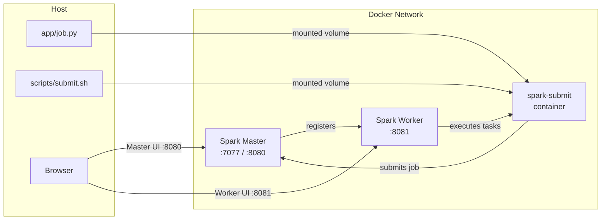
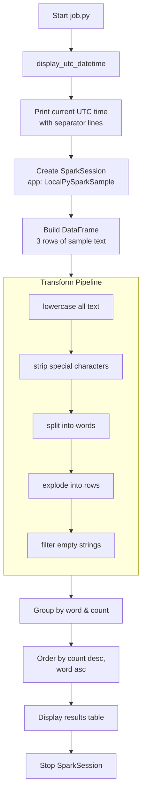
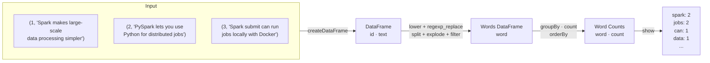
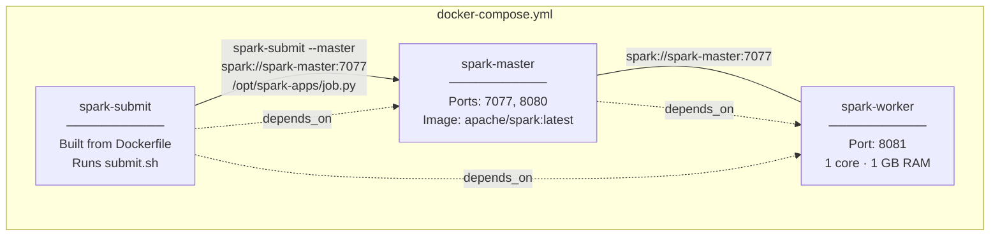
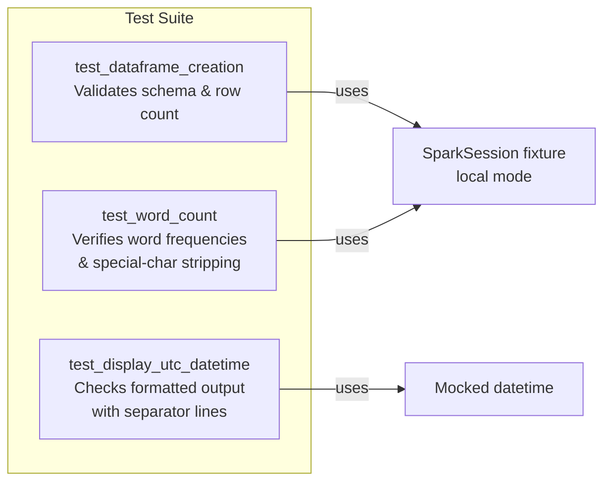

# PySpark Sample Project (Docker + spark-submit)

A containerized PySpark word-count application that runs on a local Spark cluster using Docker Compose. The project demonstrates how to set up a Spark master/worker topology, submit Python jobs via `spark-submit`, and test PySpark logic with pytest.

## Architecture



## Project Structure

```
pyspark-sample-project/
├── app/
│   └── job.py                 # PySpark word-count job
├── scripts/
│   └── submit.sh              # spark-submit wrapper
├── tests/
│   ├── conftest.py            # Spark session fixtures & env setup
│   ├── spark-conf/
│   │   └── log4j2.properties  # Suppresses noisy Spark logs in tests
│   ├── test_spark.py          # DataFrame creation & word-count tests
│   └── test_utc.py            # UTC datetime display test
├── docker-compose.yml         # Master, Worker, Submit services
├── Dockerfile                 # Extends apache/spark image
├── pyproject.toml             # Project metadata & dependencies
├── uv.lock                    # Locked dependency versions
└── .env                       # Default SPARK_IMAGE variable
```

## Job Execution Flow



## Data Pipeline



## Docker Services



## Prerequisites

- Docker Desktop (or Docker Engine with the Compose plugin)
- Python 3.12+ and [uv](https://docs.astral.sh/uv/) (for local development and testing only)

## Run the Sample

```bash
# Build the spark-submit image
docker compose build

# Start the Spark cluster
docker compose up -d spark-master spark-worker

# Submit the PySpark job
docker compose run --rm spark-submit
```

Expected output:

```
%%%%%%%%%%%%%%%%%%%%%%%%%%%%%%%%%%%%%%%%%%%%%%
Current UTC date/time: 2026-02-27 12:30:45 UTC
%%%%%%%%%%%%%%%%%%%%%%%%%%%%%%%%%%%%%%%%%%%%%%
Word count results:
+----------+-----+
|word      |count|
+----------+-----+
|jobs      |2    |
|spark     |2    |
|can       |1    |
|data      |1    |
|distributed|1   |
|docker    |1    |
|for       |1    |
|largescale|1    |
|lets      |1    |
|locally   |1    |
|...       |...  |
+----------+-----+
```

## Testing

Tests run locally using a single-node Spark session (no Docker required):

```bash
# Install dev dependencies
uv sync

# Run all tests
uv run pytest

# Run a specific test file
uv run pytest tests/test_utc.py -v
```



## Spark UI

While the cluster is running:

| UI | URL |
|---|---|
| Master | [http://localhost:8080](http://localhost:8080) |
| Worker | [http://localhost:8081](http://localhost:8081) |

## Stop and Clean Up

```bash
docker compose down
```

## Configuration

### Spark image

The default image is `apache/spark:latest` (set in `.env`). Override it with the `SPARK_IMAGE` variable:

```bash
SPARK_IMAGE=apache/spark:<tag> docker compose build
SPARK_IMAGE=apache/spark:<tag> docker compose up -d spark-master spark-worker
SPARK_IMAGE=apache/spark:<tag> docker compose run --rm spark-submit
```

### Dependencies

Managed with [uv](https://docs.astral.sh/uv/) via `pyproject.toml`:

| Package | Role |
|---|---|
| `pyspark >=4.1.1` | Spark Python API |
| `pytest >=9.0.2` | Test framework (dev) |
